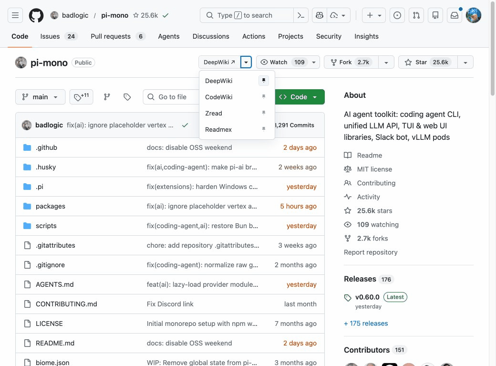

# RepoWiki

A Chrome extension that adds a **split button** to every GitHub repository page, letting you instantly open any repo in your preferred AI wiki provider — DeepWiki, CodeWiki, Zread, or Readmex.



---

## Features

- **Split button on GitHub repo pages** — click the left half to open the pinned provider directly, click `▾` to pick another
- **Pin any provider** — click the pin icon in the dropdown to change your default; saved to sync storage
- **4 providers built-in**, all enabled by default

| Provider | URL pattern |
|---|---|
| DeepWiki | `deepwiki.com/<owner>/<repo>` |
| CodeWiki | `codewiki.google/github.com/<owner>/<repo>` |
| Zread | `zread.ai/<owner>/<repo>` |
| Readmex | `readmex.com/<owner>/<repo>` |

- **Dark mode** — matches GitHub's light/dark theme automatically
- **Rainbow hover effect** on the button
- **Live sync** — toggling a provider in the popup immediately updates the page button
- **Popup** — manage which providers are enabled; the pinned provider shows as a prominent quick-open button

---

## Installation

### From a Release (recommended)

1. Go to the [Releases](../../releases) page and download the latest `chrome-extension-deepwiki-*-chrome.zip`
2. Unzip the file
3. Open Chrome and navigate to `chrome://extensions`
4. Enable **Developer mode** (toggle in the top-right)
5. Click **Load unpacked** and select the unzipped folder

### From Source

```bash
git clone https://github.com/<your-username>/chrome-extension-deepwiki.git
cd chrome-extension-deepwiki
npm install
npm run build
```

Then load `.output/chrome-mv3` as an unpacked extension (steps 3–5 above).

---

## Development

```bash
npm install       # install dependencies
npm run dev       # build + watch (WXT dev mode)
npm run build     # production build
npm run zip       # build + package as .zip for distribution
```

Built with [WXT](https://wxt.dev) (TypeScript, Manifest V3).

### Project structure

```
entrypoints/
  content.ts          # injected into GitHub repo pages
  popup/
    index.html        # popup UI
    main.ts           # popup logic
utils/
  providers.ts        # provider definitions
```

---

## How it works

On every GitHub repo page (`github.com/<owner>/<repo>`) the content script injects a split button into the repository action bar alongside Watch / Star / Fork.

- **Left button** — opens the pinned provider in a new tab
- **Chevron button** — opens a dropdown listing all enabled providers; each row has a pin icon to change the pinned provider

Provider enable/disable state and the pinned provider are stored in `chrome.storage.sync`, so settings follow you across devices.
